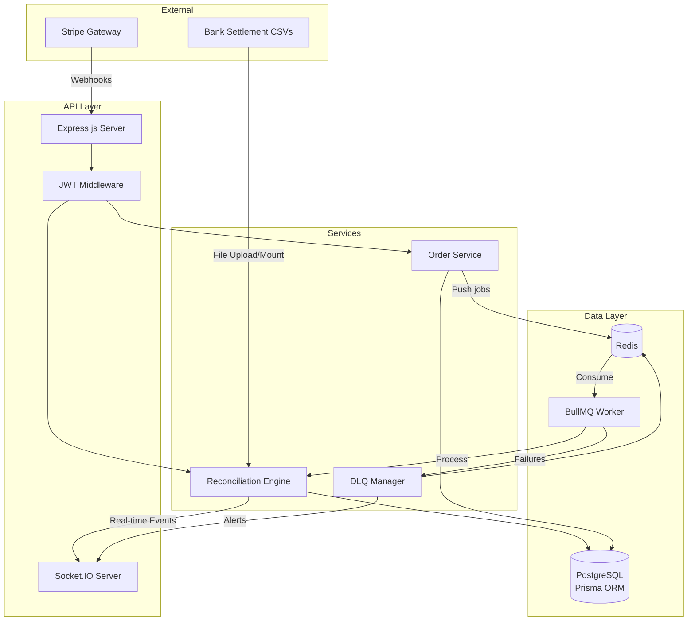

# ReconcileFlow

A production-grade payment reconciliation engine simulation designed to accurately match gateway transactions with bank settlements.

## Architecture

The system is built as a highly scalable microservices-like monolith, featuring robust background processing, idempotent webhooks, and a resilient dead-letter queue.



## Features

- **Idempotent Webhook Ingestion**: Safely handles Stripe webhooks, preventing duplicate processing even during retries.
- **Asynchronous Processing**: Uses BullMQ for scalable background jobs.
- **Settlement Ingestion**: Processes chunked CSV files for scalable ingestion with transactional rollback support.
- **4-Tier Matching Algorithm**:
  1. Exact Match
  2. Fuzzy Time-Window Match (±24h)
  3. Fee-Adjusted Match (±1%)
  4. Unmatched Detection
- **Immutable Audit Log**: Enforces append-only tracking for financial compliance.
- **Real-Time Dashboard**: Monitor queue stats and system health in real time via Socket.IO.
- **Chaos Mode**: Simulate system failures (dropped events, delayed processing) to demonstrate fault tolerance and DLQ handling.

## Recruiter Demo Flow

The app includes a self-contained demo path so reviewers can see meaningful reconciliation behavior without setting up Stripe traffic first.

1. Open the frontend and choose **Enter Demo Workspace** on the login screen.
2. Go to **Runs** and start **Quick Demo** for the fastest showcase.
3. Open the generated run to inspect exact matches, fee-adjusted matches, 24-hour time-window matches, missing gateway records, and missing settlements.
4. Resolve an unmatched or partial record to see the manual review action captured in the immutable audit log.

Simulation modes:

| Mode | Rows | Purpose |
|---|---:|---|
| Quick Demo | 36 | Fast recruiter walkthrough with curated mismatches |
| Full Demo | 120 | Larger operational sample with more noise |
| Stress Test | 1000 | Higher-volume ingestion and matching demo |

## API Endpoints

A fully documented API is available via the `/api/docs` endpoint. Here is a brief summary:

| Endpoint | Method | Auth | Description |
|---|---|---|---|
| `/api/health` | GET | No | Basic health check for DB and Redis |
| `/api/auth/login` | POST | No | Authenticate and retrieve JWT token |
| `/api/orders` | GET | Yes | List all internal orders |
| `/api/orders` | POST | Yes | Create a new internal order |
| `/api/runs` | GET | Yes | List automated reconciliation runs |
| `/api/runs/summary` | GET | Yes | Retrieve aggregate match/mismatch statistics |
| `/api/runs/generate-settlement` | POST | Yes | Trigger a reconciliation simulation job |
| `/api/matches/:id/resolve` | POST | Yes | Manually resolve an unmatched record |
| `/api/dlq` | GET | Yes | List dead-letter queue items |
| `/api/dlq/:id/replay` | POST | Yes | Replay a failed job from the DLQ |

## Stack

- **Frontend**: React, Vite, Tailwind CSS, shadcn/ui, Zustand, TanStack Query, Recharts.
- **Backend**: Node.js, Express, TypeScript, Prisma, BullMQ, Socket.IO, Zod.
- **Database**: PostgreSQL
- **Cache / Queue**: Redis

## Setup & Deployment (Vercel + Render)

This project is perfectly optimized for a modern serverless frontend + managed backend infrastructure.

### 1. Deploy the Backend to Render

The easiest way to deploy the backend (including the PostgreSQL database and Redis instance) is to use the provided Render Blueprint:

1. Create an account on [Render.com](https://render.com).
2. Connect your GitHub repository.
3. Render will automatically detect the root `render.yaml` Blueprint, which points the backend service at the `backend` directory.
4. Once deployed, note the public URL for your backend (e.g., `https://reconcileflow-backend.onrender.com`).
5. Update `CORS_ORIGIN` in Render to your Vercel frontend URL.

The blueprint uses placeholder Stripe keys so the recruiter demo can boot without external Stripe setup. Replace them with real Stripe keys only if you want live Stripe webhook testing.

### 2. Deploy the Frontend to Vercel

Vercel is the ideal hosting platform for our Vite React application.

1. Go to `frontend/vercel.json` and ensure the API proxy points to your new Render backend URL.
2. Push your code to GitHub.
3. Import the project into [Vercel](https://vercel.com).
4. Set the Framework Preset to **Vite** and root directory to `frontend`.
5. Set `VITE_SOCKET_URL` to your Render backend URL, for example `https://reconcileflow-backend.onrender.com`.
6. Deploy!

On first load, the frontend polls `/api/health` and shows a Render warm-up message until the backend reports `healthy`.

### 3. Local Development (Docker)

If you just want to run it locally right now:

1. Create `.env` files in both `backend` and `frontend` (see `.env.example` templates).
2. Run the following command from the root folder:
   ```bash
   docker compose up --build
   ```
3. The API will be available at `http://localhost:3000` and the frontend at `http://localhost:80`.

## Local Development (Without Docker)

### Backend

1. `cd backend`
2. `npm install`
3. Ensure PostgreSQL and Redis are running locally.
4. Copy `.env.example` to `.env` and configure credentials.
5. `npm run db:push`
6. `npm run dev`

### Frontend

1. `cd frontend`
2. `npm install`
3. `npm run dev`

## Testing

The project uses `vitest` for robust unit testing of core services.

To run the backend tests:
```bash
cd backend
npm run test
```
